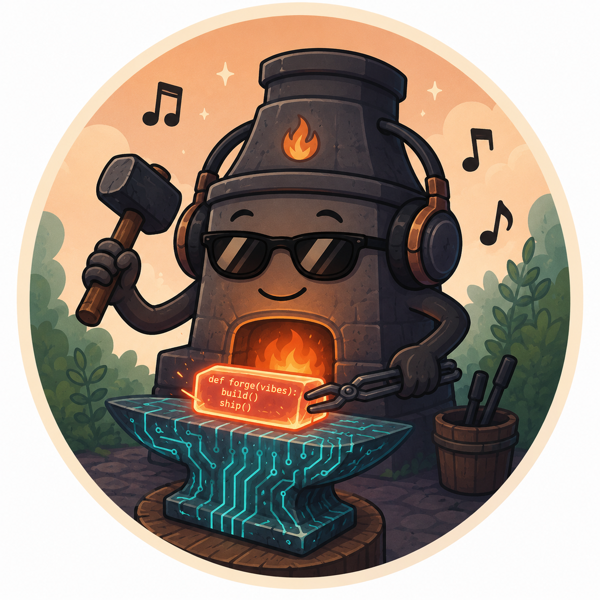

# forge



Coding models are already very capable. The lever for getting more out
of them isn't a bigger model — it's orchestration. That's what forge
is: **disciplined LLM capabilities** between you and your coding agent.
It lets a solo dev vibe reliably, at a level of complexity a standard
agent can't hold together. It spends more tokens and time running
opinionated workflows over the LLM, and gives back cleaner code, less
rework, and more autonomous execution. The benefit:
you get far more out of the same model than you would by just plain
prompting or a stock agent.

The workflows are everyday dev work — build, fix, review, solve, research,
docs — and their top-level shape follows familiar software practice. What's tuned
to how coding agents actually behave is **how each step is wired
underneath**, built to control for the ways agents go wrong — both the
well-known agentic behaviours and the ones observed dogfooding forge in
productive use ([the tendencies, described](framework/agent-patterns.md)).
Hard-to-undo decisions get a multi-perspective board or a council
before they land; when you're unsure, you can put the question to the
council yourself — decision-support, not a replacement for your
judgment. You stay in the driver's seat.

Work that outgrows a single session keeps its thread. At session end
you trigger the `save` skill; it writes a structured handoff the next
session reads on boot. Alongside it, the workflow engine tracks where
each multi-step workflow stands — which step, what state — so a paused
build resumes exactly there, and the work itself is organized as tasks
with dependencies: a validated plan with milestones and a critical
path, surfaced at every start. A multi-day, multi-step build doesn't
lose its place.

It stays simple to use and understand — a small set of processes, not a
cage. Aimed at a single dev on complex work, whether you're shipping a
product or building a system to last: the velocity of vibe-coding with
the coherence of process.

If you write all your code by hand, the full forge workflow is overkill —
it earns its weight when an agent is doing the work. The exception is the
decision layer: the **council** (hard architecture and strategy calls) and
the **boards** (multi-perspective spec and code review) work as standalone
decision-support, whoever wrote the code.

forge is dogfooded — developed by using it on real work. The core is
stable and won't shift out from under you; what keeps improving is the
nitty-gritty detail. Opinionated. Pre-1.0.

## What you actually get

Cleaner code, less rework, more autonomous execution — and work that
keeps its place across sessions. Most of it is how the workflow steps
are wired (controls against the ways coding agents go wrong); the rest
is session-spanning state. The major pieces:

- **Reviews run cold and adversarial** — reviewers derive findings
  without inheriting the orchestrator's framing, and one reviewer's
  whole job is to attack the premise, so a plausible-but-wrong frame
  doesn't slip through.
- **Claims are checked against the real code, with receipts** — against
  what's actually on disk, not the model's belief about it, and every
  finding cites a file and line. No hand-waving.
- **Structure before code** — a deep-modules lens makes a
  structural-purity pass that feeds a two-stage brief, so the work
  carries architectural awareness before a line is written;
  Architecture-Comprehension then checks coherence at the milestone
  layer, catching breaks a local view misses — a producer wired with no
  consumer, a deploy-state that can't support the change.
- **Multiple perspectives on the hard calls** — a spec-board on the
  spec, a code-review-board on the diff, a council on architecture
  decisions, instead of a single-view tunnel. You can also convene a
  council by hand any time you want fresh perspectives on a question.
- **Effort scales to the stakes** — small things don't get
  over-processed. That's the "stays simple" anchor.
- **Sessions don't start cold** — `save` writes a structured handoff the
  next session reads on boot; the workflow engine holds each multi-step
  workflow's place; work is a validated task plan with milestones and a
  critical path. A paused multi-day build resumes where it stopped, instead
  of re-deriving context.

→ [how the review apparatus works](architecture-documentation/02-architecture.md)

## Quick Start

You don't call commands. You tell Buddy what you want; Buddy classifies
the input (discuss / incident / substantial) and routes to a workflow:

| You say | Workflow |
|---|---|
| `solve <problem>` | open-ended: frame → refine → artifact → execute |
| `build task X` | spec → spec-board → code → code-review-board → close |
| `fix bug X` | root-cause first, no symptom-patching |
| `review spec X` | multi-perspective spec-board (4-7 personas + chief) |
| `research X` | knowledge artifact, not code |
| `save` | writes the session-handoff so the next session picks up the thread — run it mid-session or at session end (one command, the footprint adapts) |

For standalone frame / drill / council use, just ask in plain language;
Buddy picks the entry point.

**`save` is the session-end skill.** Without it, the next session
starts cold — workflow state in `.workflow-state/<id>.json` still
resumes, but the discussion thread, open decisions, and "where I was
heading" don't. Type `save` before you close the terminal — or any
time mid-day when you're switching context and want to leave a
breadcrumb; it's the same command, and the footprint adapts. See
[Cross-session continuity](#cross-session-continuity) below.

## How it works

Every session enters through **Buddy** — the single orchestrator persona.
Buddy handles intake, classifies the request, and routes to one of the
eight workflows; sub-agents do the actual work.

A `build`, for example, walks the same arc every time: scoping → spec
interview → a spec-board (4–7 reviewer personas in parallel + a chief
consolidator) → main-code-agent implements → a code-review-board on the
diff → close. The eight workflows carry the methodology; the 41 active
skills carry the moves inside each phase. The boards and the council run
context-isolated — Buddy doesn't colour the reviewers' findings and
reads only the chief's consolidated signal — and the council runs in
four modes (light / standard / full / interactive), scaled to the
decision.

```
                   ┌─────────────────────────────────────────┐
  plain-text  ───► │  BUDDY  (single orchestrator persona)   │
  intent           │  intake-gate · routing · pre-delegation │
                   └────────────────────┬────────────────────┘
                                        │
                   ┌────────────────────▼────────────────────┐
                   │  WORKFLOW   build · solve · fix ·       │
                   │             review · research ·         │
                   │             docs-rewrite · save · …     │
                   │  multi-phase, cross-session state       │
                   │  (.workflow-state/<id>.json)            │
                   └────────────────────┬────────────────────┘
                                        │  per phase
               ┌────────────────────────┼────────────────────────┐
               ▼                        ▼                        ▼
        ┌─────────────┐          ┌─────────────┐         ┌─────────────┐
        │  SKILLS     │          │  BOARDS     │         │  COUNCIL    │
        │  41 active  │          │  spec/UX/   │         │  arch deci- │
        │  single-    │          │  code, 4-14 │         │  sions, 4-5 │
        │  purpose    │          │  personas   │         │  members +  │
        │             │          │  + chief    │         │  adversary  │
        └──────┬──────┘          └──────┬──────┘         └──────┬──────┘
               │                        │                        │
               └────────────────────────┼────────────────────────┘
                                        ▼
                              ┌──────────────────┐
                              │   SUB-AGENTS     │   main-code-agent,
                              │   do the work    │   council-member,
                              │                  │   reviewers, …
                              └────────┬─────────┘
                                       │
                                       ▼
                                    RESULT

  ── HOOKS (universal-portable only) ──
     SessionStart (boot inject) · git pre-commit (6 checks)
     PLAN-VALIDATE BLOCK · CG-CONV BLOCK · SKILL-FM-VALIDATE BLOCK
     SECRET-SCAN WARN · SOURCE-VERIFICATION WARN · ANTI-PHANTOM WARN
```

## Cross-session continuity

Multi-session work doesn't restart from scratch — but only if you end
sessions with `save`.

- **`save`** — the user-triggered persistence skill for both
  session-end and mid-session. Type `save` before closing the terminal; Buddy writes a
  structured session-handoff (meta-summary, open topics, decisions,
  next steps). The next session reads it on boot and picks up the
  thread. Run it mid-day for a context switch too — same command, a
  lighter footprint when there's nothing to close out.
- **Workflow engine** — non-trivial workflows (`build`, `fix`,
  `solve`, `review`, `research`, `docs-rewrite`) persist state per
  task in `.workflow-state/<id>.json`. Pause a multi-day build
  mid-step today, resume at the same step tomorrow, on a different
  machine, with full phase history.
- **Boot continuity** — on session start the orchestrator loads
  active intent, session-handoff, and in-flight workflows, then tells
  you where you left off. No manual context reconstruction.

## Setup

forge runs on top of an existing coding-agent harness — Claude Code,
OpenCode, Codex, or Cursor. You need `git`, `bash`, `jq`, and Python
3.10+. One command provisions the Claude Code adapter — the `cc`
launcher, persona + skill discovery, the SessionStart boot hook, and
the git pre-commit checks:

```bash
git clone https://github.com/NashEQify/forge ~/forge
bash ~/forge/scripts/setup-cc.sh
```

Then start a session in any repo:

```bash
cc <project>        # Claude Code (or bare `cc` for the current dir)
```

Other harnesses: `setup-oc.sh` (OpenCode), `setup-codex.sh` (Codex);
Cursor ships rules under `orchestrators/cursor/`. Each script is
idempotent — re-run any time to repair.

**Full details** — prerequisites, per-harness setup, consumer-repo
wiring, verification:
[`05-installation.md`](architecture-documentation/05-installation.md).

## Honest cost & scope

The discipline layer isn't free. A `build` for a substantial task
spawns a 4-7 persona spec-board (5-15k tokens each), a code-review-
board on the diff, and persists workflow state across phases. When a
hard architectural decision comes up it can also convene a council
(3-7 context-isolated members + adversary + chief) — conditional, but
another multiplier on the turns it touches.
**50-200k tokens go to the discipline layer per substantial build, on
top of the actual implementation** (more when a council is convened).
That earns its keep when a board catches a spec-violation worth a day
of re-work; it's wasteful on a typo-fix.

For a 30-minute script, a slash-command catalog is faster. forge is
for the work where coherence across sessions is the bottleneck — long
multi-day builds, multi-repo work, anything where context loss costs
more than the discipline overhead.

**Adapters.** forge's discipline lives in several layers: skills
(markdown + YAML), workflow runbooks, the workflow engine (Python +
YAML state), persona definitions, task / plan YAMLs, and a thin hook
layer (SessionStart boot + git pre-commit). Most of it is
harness-neutral — any harness that loads MD + YAML and can spawn
sub-agents can run forge. An adapter buys mechanical persona / skill
discovery, tier-0 anchor loading, and the boot + commit-time hooks
wired into the harness startup and the repo's git hooks.

Cursor is the fourth shipped adapter; it has no tool-event API and no
SessionStart hook, so its mechanical layer is git pre-commit plus the
rules + persona wrapper — everything else runs identically. Any
harness without a dedicated adapter can still load the skills and run
the workflows; discovery is just less mechanical.

**What this isn't.** Not a generic agent framework, not a marketplace,
not a LangChain-style abstraction, not an onboarding product.
Adapter-based on top of an existing harness, not a re-implementation.

## Inventory (live)

- **Skills:** [`framework/skill-map.md`](framework/skill-map.md) (41 active + 1 deprecated)
- **Personas:** [`agents/navigation.md`](agents/navigation.md) (40, incl. boards + council)
- **Workflows + Routing:** [`framework/process-map.md`](framework/process-map.md)
- **Protocols / References / Hooks:** [`architecture-documentation/02-architecture.md`](architecture-documentation/02-architecture.md)

## Where to go next

| If you are... | Start with |
|---|---|
| **Just trying it out** | [Quick Start](#quick-start) above |
| **Daily user / practitioner** | [`13-operational-handbook.md`](architecture-documentation/13-operational-handbook.md) |
| **Want to understand the model** | [`01-overview.md`](architecture-documentation/01-overview.md) → [`02-architecture.md`](architecture-documentation/02-architecture.md) |
| **Building a skill** | [`04-core-concepts.md`](architecture-documentation/04-core-concepts.md) + [`08-development-and-maintenance.md`](architecture-documentation/08-development-and-maintenance.md) |
| **Adding an adapter** | [`07-tool-integrations.md`](architecture-documentation/07-tool-integrations.md) |
| **Agent patterns forge hardens against** | [`framework/agent-patterns.md`](framework/agent-patterns.md) |

## Read more

1. [`13-operational-handbook.md`](architecture-documentation/13-operational-handbook.md) —
   methodology-in-practice, daily patterns. If you read one file, read this.
2. [`architecture-documentation/`](architecture-documentation/README.md) —
   13-file reader-journey hub.
3. [`framework/skill-anatomy.md`](framework/skill-anatomy.md) —
   strict shape every skill follows (mechanically validated).
4. [`framework/agent-patterns.md`](framework/agent-patterns.md) —
   the agent failure modes forge hardens against.
5. [`references/agentic-design-principles.md`](references/agentic-design-principles.md) —
   research-derived design principles backing the framework's skill /
   persona / runbook design. Historical reference, not consulted in
   the runtime loop.

## Contributing

See [`CONTRIBUTING.md`](CONTRIBUTING.md) for conventions, PR process, and
hook setup. Security policy: [`SECURITY.md`](SECURITY.md). Code of conduct:
[`CODE_OF_CONDUCT.md`](CODE_OF_CONDUCT.md).

## License

[MIT](LICENSE).
